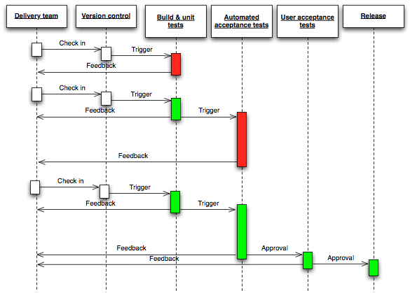

Build Light
===========

Continuous Delivery is a pattern language used in software development to automate and improve the process of
software delivery. Techniques such as automated testing, continuous integration and continuous deployment allow
software to be developed to a high standard and easily packaged and deployed to test environments, resulting in
the ability to rapidly, reliably and repeatedly push out enhancements and bug fixes to customers at low risk and
with minimal manual overhead.



Continuous delivery treats the commonplace notion of a deployment pipeline: a set of validations through which a piece
of software must pass on its way to release. Code is compiled if necessary and then packaged by a build server
every time a change is committed to a source control repository, then tested by a number of different techniques
before it can be marked as releasable.

Developers used to a long cycle time may need to change their mindset when working in a Continuous Delivery environment.
It is important to understand that any code commit may be released to customers at any point.

What is Build Light
-------------------


Cleware Traffic Java Driver
---------------------------

[Download](https://raw.github.com/zutherb/build-light/master/bin/cleware.jar)

```bash
java -jar cleware.jar
java -jar cleware-0.1-DEV.jar red on wait 500 yellow on wait 500 green on
java -jar cleware-0.1-DEV.jar red off wait 500 yellow off wait 500 green off
```